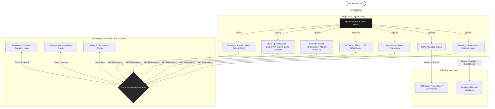
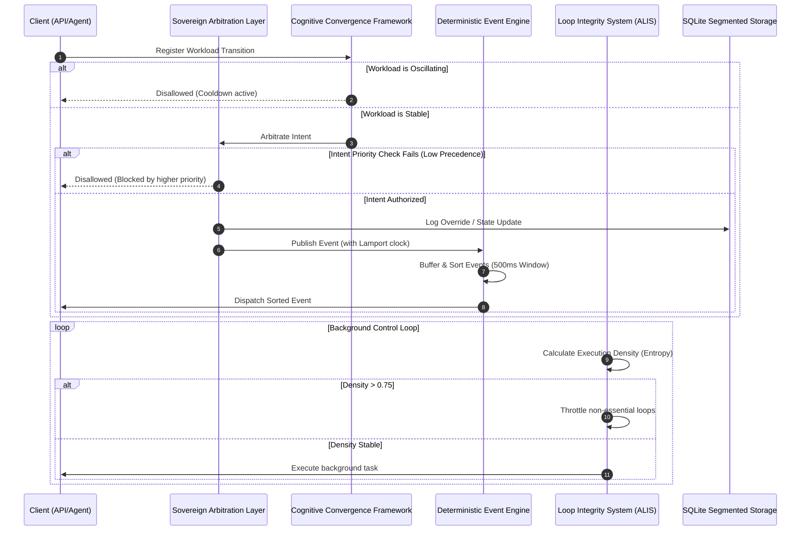

# ⚛️ KalpanaOS — Distributed Sovereign Cognitive Infrastructure

[](https://opensource.org/licenses/MIT)
[](https://docs.docker.com/)
[](https://go.dev/)
[](https://qdrant.tech/)
[](https://nats.io/)

**KalpanaOS** is a next-generation, AI-native infrastructure operating system specifically engineered to run on resource-constrained edge environments. Operating under a strict **4GB RAM ceiling**, it completely bypasses massive, declarative, YAML-heavy DevOps frameworks like Kubernetes.

Instead, KalpanaOS establishes a **Distributed Cognitive Infrastructure**: a self-healing, P2P federated mesh where autonomous AI agents orchestrate containers, manage episodic memory, govern local infrastructure policies, and remediate system anomalies without human intervention.

---

## 🧠 Core Philosophy & Constraints

*   ⚡ **AI-Native Control Plane:** No complex CLI commands or configuration files required. The control plane is powered by natural language, driven by an AI agent fleet using Retrieval-Augmented Generation (RAG) to understand system state.
*   🛡️ **Sovereignty & Hardening:** Built entirely on lightweight, decentralized components (SQLite, NATS, Qdrant, Docker API). Heavy LLM inference is dynamically offloaded to the NVIDIA AI API to preserve local host resources.
*   🌐 **Federated Edge Mesh:** Nodes operate as equal peers. They broadcast capabilities over NATS JetStream and intelligently distribute workloads to the most capable node in the mesh.
*   💾 **Semantic Memory Lifecycle:** Infrastructure systems generate huge logs. KalpanaOS uses a background AI agent to synthesize raw logs into dense semantic insights, deleting raw logs recursively to prevent disk exhaustion.
*   🔒 **Zero-Trust sandboxing:** Containers are managed under unprivileged sandboxes with seccomp blocks, capability drops, and volume restriction rules.

---

## 🏗️ Architectural Overview

KalpanaOS is built as a suite of lightweight Go microservices communicating over a local/mesh NATS JetStream event bus:



### Core Services

| Service | Component Name | Description |
| :--- | :--- | :--- |
| **SIL** | Sovereign Identity Layer | Cryptographic token-based authorization (JWT) and user RBAC management. |
| **COL** | Cloud Operating Layer | Interacts with `/var/run/docker.sock` to manage containers, and simulates Git-based compilation of Web, Android, and iOS apps. |
| **SSI** | Semantic Search Infrastructure | Connects with Qdrant vector database to store and query episodic logs and system insights. |
| **AICP** | AI Control Plane | Translates natural language requests into infrastructure APIs, pulling historical context from SSI and live topology from COL. |
| **AAF** | Autonomous Agent Framework | Hosts background agents (e.g. `RemediationAgent`, `MemoryCompressionAgent`, `PredictiveScalingAgent`) that operate on loop. |
| **SIRL** | Sovereign Infrastructure Runtime Layer | Core OS container runtime, enforcing sandboxing (RIB), segmented storage, and executing the DCCL coordination stack. |
| **PGE** | Policy & Governance Engine | An immutable constitutional layer that intercepts all container deployments and deletions to enforce security rules. |
| **IKG** | Infrastructure Knowledge Graph | An in-memory Go adjacency list mapping live dependencies between nodes and containers in real-time. |
| **FDCL** | Federated Distributed Cognition Layer | Handles P2P gossip capability exchange and schedules workloads dynamically to capable mesh peers. |
| **CBAL** | Cognitive Behavior & Analytics Layer | DuckDB-based time-series analytics engine recording telemetry data and compressing telemetry footprints. |

---

## 🛡️ Sovereign Infrastructure Runtime Layer (SIRL)

The **Sovereign Infrastructure Runtime Layer (SIRL)** functions as an AI-native runtime substrate for distributed cognitive workloads. It enforces strict security boundaries and resources under edge constraints:

1.  **Runtime Isolation Broker (RIB):** Validates all container creation payloads. It strips privileged mode, blocks host network mappings (`NetworkMode = "host"`), enforces strict capability drops (`CapDrop = ["ALL"]`, `CapAdd = ["NET_BIND_SERVICE"]`), prevents privilege escalation, and restricts host mounts to authorized sandbox folders.
2.  **Distributed Storage Segmentation:** Replaces large single databases with four isolated SQLite databases operating in high-concurrency WAL mode:
    *   `runtime.db`: Contains node configurations, workloads, and mesh registration maps.
    *   `telemetry.db`: Caches local memory, CPU, and temperature samples.
    *   `governance.db`: Houses audit logs, seccomp filters, and execution credentials.
    *   `cognition.db`: Manages recovery state records and the intent causal lineage graph.
3.  **Intent Graph Engine (IGE):** Models all modifications to infrastructure as Directed Acyclic Graphs (DAG) mapping causality from `Intent -> Decision -> Action -> Effect -> Recovery -> Memory`. A background routine compactions and prunes graph history older than 72 hours.
4.  **Infrastructure Cognition Budgeting (ICB):** Enforces credit limits (embeddings: 5 credits, simulation: 8 credits, graph traversal: 12 credits) to throttle background reasoning and prevent CPU saturation if RAM usage exceeds 80%.
5.  **Event Saturation Governance Layer (ESGL):** Classifies network signals into:
    *   *Priority 1 (Critical)*: Immediate dispatch (policy violations, node crashes).
    *   *Priority 2 (Operational)*: Buffered and flushed as 5-minute averages (CPU/RAM telemetry).
    *   *Priority 3 (Cognitive)*: Semically compressed before transmitting, saving up to 90% bandwidth.
6.  **Adaptive Cognitive Scheduler (ACSE):** Computes Node Stability Indices (NSI) based on node crashes and quarantines unstable instances.
7.  **Recovery Stabilization System (RSF):** Manages a state machine (`Normal -> Recovering -> Degraded -> Quarantined`). Applies exponential cooldown sleep limits during container crash loops, triggers image rollbacks, and isolates mounts.

---

## 🔗 Deterministic Cognitive Coordination Layer (DCCL)

Without deterministic coordination, recursive interactions between autonomous agents, scaling policies, and recovery routines would lead to deadlocks or orchestration storms. The **DCCL** provides that deterministic substrate:



### DCCL Sub-Modules

*   **Sovereign Arbitration Layer (SAL):** Resolves overlap conflicts using domain precedence hierarchy (`Governance > Recovery > Coordination > Predictive`). Oldest timestamp tie-breakers are applied when domains match.
*   **Deterministic Event Coordination Engine (DECE):** Buffers NATS events in a 500ms window, sorting them by `Epoch -> Lamport Clock -> NodeID` before execution, ensuring identical order across all nodes.
*   **Cognitive Convergence Framework (CCF):** Tracks workload transitions. If a workload transitions $\ge 3$ times within 10 minutes, CCF detects an oscillation loop, applies exponential damping cooldowns (capped at 2 hours), and updates states.
*   **Federated Consistency Layer (FCCL):** Synchronizes causal graphs eventual-consistently using Observed-Remove-Set (OR-Set) CRDT metadata exchanges over NATS, guaranteeing consensus-free synchronization over weak networks.
*   **Infrastructure Temporal Stability Engine (ITSE):** Computes linear regression memory growth trends and CPU variance. If behavioral drift exceeds 0.85, it forces SQLite checkpoints (`PRAGMA wal_checkpoint(TRUNCATE)`) to compact storage.
*   **Bounded Graph Traversal Engine (BGTE):** Depth-limits BFS queries to 3 hops and prunes low-priority branches (such as `TRIGGERED_BY` predictive simulations at depth $\ge 2$) to keep search fast.
*   **Autonomous Loop Integrity System (ALIS):** Registers control loops and computes loop execution density (Loop Entropy). If total density exceeds 0.75, it throttles non-essential loops (such as gossip, sync, and compaction).
*   **Sovereign Runtime Determinism Metrics (SRDM):** Computes and exports gauges to Prometheus:
    *   `sirl_cognitive_stability_index` (CSI)
    *   `sirl_autonomous_convergence_score` (ACS)
    *   `sirl_governance_integrity_score` (GIS)
    *   `sirl_recovery_stability_ratio` (RSR)

---

## 🌐 Public Portal & Secure Download Registration

To make hosting and exposure of KalpanaOS user-friendly, the Web UI is structured into two main access routes:

### 1. Public Landing Page (`/` -> `index.html`)
The default root path serves a public landing page featuring an **About Section** detailing the OS architecture, and a **Downloads Portal** offering installation utilities:
*   **Bootstrapper Installer Script (`install.sh`):** A shell utility to automatically check requirements and pull the stack.
*   **CLI Control Binary (`kalpana`):** The compiled terminal controller binary.

### 2. Administrative Console (`/dashboard.html`)
The main control panel, chat interface, event logs, and app compiler terminals are situated on a dedicated page (`/dashboard.html`). If a user has valid session credentials stored in their browser, they bypass the login wall automatically.

### 3. Register-on-Download Flow
Clicking any download action on the public landing page triggers a secure **Admin Registration Modal**:
*   Prompts the user to create an administrative account (Email & Password).
*   Submits a request to the Sovereign Identity Layer (`POST /api/sil/auth/register`), which hashes the credentials and saves the user directly in the database, mapping them to the `admin` role.
*   Automatically saves the JWT access and refresh tokens to local storage.
*   Initiates the browser file download.
*   **Auto-Login:** Once registered, clicking "Launch Console" takes the user directly to their dashboard at `/dashboard.html` without prompting them to log in again.

---

## 🚀 Deployment & Installation

### Prerequisites
*   Docker & Docker Compose (v1.29+ or v2)
*   Network port `8011` exposed for mTLS communication.
*   Network port `8222`/`4222` exposed for NATS gossip.

### 1. Fast Bootstrap Installer
You can download the installer directly from your public instance URL. Simply run:
```bash
curl -sSL https://<your-public-url>/install.sh | bash
```

### 2. Manual Source Build
To build and deploy the SIRL daemon image on your edge node:
```bash
# Clone the repository
git clone https://github.com/Ashutoshsingh20/Kalpanaos.git
cd Kalpanaos

# Build services
docker-compose build sirl
```

### 3. Run the Stack
```bash
# Clean up any lingering container configurations
docker rm -f kalpana-sirl

# Deploy container
docker-compose up -d sirl
```

---

## 🧪 Verification & Testing Suite

### 1. Unit Testing
We provide a comprehensive unit test suite in [dccl_test.go](file:///Users/shu/Desktop/Kalpanaos/services/sirl/dccl_test.go) that runs isolated tests across all DCCL components using unique, shared-cache SQLite memory databases.

To run tests inside a container:
```bash
docker run --rm -v $(pwd)/services/sirl:/build -w /build golang:1.22-alpine sh -c \
  "apk add --no-cache gcc musl-dev sqlite-dev && GOWORK=off go mod tidy && GOWORK=off CGO_ENABLED=1 go test -v -tags sqlite_foreign_keys ./..."
```

**Expected Output:**
```text
=== RUN   TestSovereignArbitrationLayer
2026/05/26 14:08:17 [SAL] Overriding active intent deploy (Domain 3) with higher-priority intent terminate (Domain 1) for workload w1
--- PASS: TestSovereignArbitrationLayer (0.73s)
=== RUN   TestDeterministicEventCoordinationEngine
--- PASS: TestDeterministicEventCoordinationEngine (0.00s)
=== RUN   TestCognitiveConvergenceFramework
2026/05/26 14:08:18 [CCF] CRITICAL: Oscillation loop detected on workload w1 (3 transitions in 1m0s). Damping applied for 2m0s.
--- PASS: TestCognitiveConvergenceFramework (0.00s)
=== RUN   TestAutonomousLoopIntegritySystem
2026/05/26 14:08:18 [ALIS] Loop execution density (0.800) exceeds bounds! Suppressing non-essential loop 'mesh_sync' for 15s
--- PASS: TestAutonomousLoopIntegritySystem (0.00s)
=== RUN   TestInfrastructureTemporalStabilityEngine
2026/05/26 14:08:18 [ITSE] Node Behavioral Drift calculated: 0.600 (Mem Slope: 2048.00 KB/s, CPU Variance: 0.00)
2026/05/26 14:08:18 [ITSE] Node Behavioral Drift calculated: 1.000 (Mem Slope: 5120.00 KB/s, CPU Variance: 1406.25)
2026/05/26 14:08:18 [ITSE] WARNING: Node behavioral drift (1.000) exceeds equilibrium boundary! Forcing topology compaction.
--- PASS: TestInfrastructureTemporalStabilityEngine (0.01s)
=== RUN   TestBoundedGraphTraversalEngine
--- PASS: TestBoundedGraphTraversalEngine (0.01s)
PASS
ok  	github.com/kalpanaos/sirl	0.757s
```

### 2. Loop Stats Inspection (REST)
Inspect active loop states by querying the mTLS authenticated `/api/sirl/loop/stats` endpoint:
```bash
docker exec kalpana-sirl wget -qO- \
  --ca-certificate=/certs/ca.crt \
  --certificate=/certs/sirl/client.crt \
  --private-key=/certs/sirl/client.key \
  https://localhost:8011/api/sirl/loop/stats
```

### 3. Stability Index Inspection (Prometheus)
Inspect reporting gauges:
```bash
docker exec kalpana-sirl wget -qO- \
  --ca-certificate=/certs/ca.crt \
  --certificate=/certs/sirl/client.crt \
  --private-key=/certs/sirl/client.key \
  https://localhost:8011/metrics | grep sirl_
```

---

## 📜 License

KalpanaOS is an experimental research project in Autonomous Infrastructure and Distributed Cognition. Open-sourced under the [MIT License](LICENSE).
