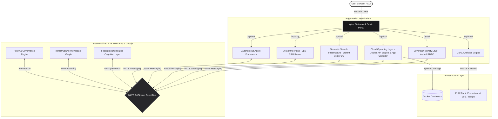

# ⚛️ KalpanaOS — Distributed Sovereign Cognitive Infrastructure

[](https://opensource.org/licenses/MIT)
[](https://docs.docker.com/)
[](https://go.dev/)
[](https://qdrant.tech/)

**KalpanaOS** is a next-generation, AI-native infrastructure operating system specifically engineered to run on resource-constrained edge environments. Operating within a strict **4GB RAM ceiling**, it abandons massive, declarative, YAML-heavy DevOps frameworks like Kubernetes. 

Instead, KalpanaOS establishes a **Distributed Cognitive Infrastructure**: a self-healing, P2P federated mesh where autonomous AI agents orchestrate containers, manage episodic memory, govern local infrastructure policies, and remediate system anomalies without human intervention.

---

## 🧠 Core Philosophy & Constraints

* ⚡ **AI-Native Control Plane:** No complex CLI commands or configuration files required. The control plane is powered by natural language, driven by an AI agent fleet using Retrieval-Augmented Generation (RAG) to understand system state.
* 🛡️ **Sovereignty & Isolation:** Built entirely on lightweight, decentralized components (SQLite, NATS, Qdrant, Docker API). Heavy LLM inference is dynamically offloaded to the NVIDIA AI API to preserve local host resources.
* 🌐 **Federated Edge Mesh:** Nodes operate as equal peers. They broadcast capabilities over NATS JetStream and intelligently distribute workloads to the most capable node in the mesh.
* 💾 **Semantic Memory Lifecycle:** Infrastructure systems generate huge logs. KalpanaOS uses a background AI agent to synthesize raw logs into dense semantic insights, deleting raw logs recursively to prevent disk exhaustion.

---

## 🏗️ Architectural Overview

KalpanaOS is built as a suite of lightweight Go microservices communicating over a local/mesh NATS JetStream event bus:



### Core Services

| Service | Component Name | Description |
| :--- | :--- | :--- |
| **SIL** | Sovereign Identity Layer | Cryptographic token-based authorization (JWT) and user RBAC management. |
| **COL** | Cloud Operating Layer | Interacts with `/var/run/docker.sock` to manage containers, and simulates Git-based compilation of Web, Android, and iOS apps. |
| **SSI** | Semantic Search Infrastructure | Connects with Qdrant vector database to store and query episodic logs and system insights. |
| **AICP** | AI Control Plane | Translates natural language requests into infrastructure APIs, pulling historical context from SSI and live topology from COL. |
| **AAF** | Autonomous Agent Framework | Hosts background agents (e.g. `RemediationAgent`, `MemoryCompressionAgent`, `PredictiveScalingAgent`) that operate on loop. |
| **PGE** | Policy & Governance Engine | An immutable constitutional layer that intercepts all container deployments and deletions to enforce security rules. |
| **IKG** | Infrastructure Knowledge Graph | An in-memory Go adjacency list mapping live dependencies between nodes and containers in real-time. |
| **FDCL** | Federated Distributed Cognition Layer | Handles P2P gossip capability exchange and schedules workloads dynamically to capable mesh peers. |
| **CBAL** | Cognitive Behavior & Analytics Layer | DuckDB-based time-series analytics engine recording telemetry data and compressing telemetry footprints. |

---

## 🌐 Public Portal & Secure Download Registration

To make hosting and exposure of KalpanaOS user-friendly, the Web UI is structured into two main access routes:

### 1. Public Landing Page (`/` -> `index.html`)
The default root path serves a public landing page featuring an **About Section** detailing the OS architecture, and a **Downloads Portal** offering installation utilities:
* **Bootstrapper Installer Script (`install.sh`):** A shell utility to automatically check requirements and pull the stack.
* **CLI Control Binary (`kalpana`):** The compiled terminal controller binary.

### 2. Administrative Console (`/dashboard.html`)
The main control panel, chat interface, event logs, and app compiler terminals are situated on a dedicated page (`/dashboard.html`). If a user has valid session credentials stored in their browser, they bypass the login wall automatically.

### 3. Register-on-Download Flow
Clicking any download action on the public landing page triggers a secure **Admin Registration Modal**:
* Prompts the user to create an administrative account (Email & Password).
* Submits a request to the Sovereign Identity Layer (`POST /api/sil/auth/register`), which hashes the credentials and saves the user directly in the database, mapping them to the `admin` role.
* Automatically saves the JWT access and refresh tokens to local storage.
* Initiates the browser file download.
* **Auto-Login:** Once registered, clicking "Launch Console" takes the user directly to their management dashboard at `/dashboard.html` without prompting them to log in again.

---

## 🚀 Deployment & Installation

### 1. Fast Bootstrap Installer
You can download the installer directly from your public instance URL. Simply run:
```bash
curl -sSL https://<your-public-url>/install.sh | bash
```

### 2. Stable Zero-Config Public Tunnel
If your edge server is behind a local NAT router or firewall, the stack includes a self-healing **`tunnel`** service inside `docker-compose.yml` that opens a secure reverse tunnel using **Cloudflare Quick Tunnel (`trycloudflare.com`)**.
* On startup, the container automatically establishes a secure tunnel mapping to the Nginx UI.
* You can view your generated public HTTPS address by checking the container logs:
  ```bash
  docker logs kalpana-tunnel
  ```
  **Output Box Example:**
  ```text
  ===================================================
     KALPANA OS PUBLIC TUNNEL ACTIVE
     Your public domain is:
     https://producing-product-rugs-dynamic.trycloudflare.com
  ===================================================
  ```

---

## 🛠️ Interacting with KalpanaOS

You do not write declarative YAML manifests to deploy apps on KalpanaOS. You ask the `AICP` or submit a task to `AAF`.

### Example: Scheduling a Deployment via API

```bash
# 1. Get SIL Auth Token
TOKEN=$(curl -s -X POST -H "Content-Type: application/json" \
  -d '{"email":"your_email@domain.com","password":"your_password"}' \
  https://producing-product-rugs-dynamic.trycloudflare.com/api/sil/auth/login | jq -r .access_token)

# 2. Dispatch Task to AAF
curl -s -X POST -H "Content-Type: application/json" \
  -H "Authorization: Bearer $TOKEN" \
  -d '{
    "agent_id": "SchedulerAgent",
    "input": "{\"name\":\"web-server\",\"image\":\"nginx:alpine\",\"ports\":[\"8080:80\"]}"
  }' \
  https://producing-product-rugs-dynamic.trycloudflare.com/api/aaf/tasks
```

The system will intelligently query the `IKG` for telemetry, check policies with `PGE`, route the deployment to the best node over NATS, and update the graph in real-time.

---

## 🔒 Security & Architecture Decisions

* **No Local LLMs:** To strictly adhere to the 4GB RAM ceiling, all local models (Ollama/Llama3.2) were stripped out in Phase 5. KalpanaOS exclusively uses the NVIDIA API, maintaining extremely lightweight Go binaries.
* **SQLite + CGO:** All services rely on lightweight, isolated SQLite databases. This avoids the massive memory overhead of running PostgreSQL or MySQL clusters.
* **NATS over HTTP:** Internal service communication heavily favors NATS JetStream for pub/sub decoupling (like `kalpana.col.events` and `kalpana.fdcl.gossip`) to ensure resilience if individual nodes crash.

---

## 📜 License
KalpanaOS is an experimental research project in Autonomous Infrastructure and Distributed Cognition. Open-sourced under the [MIT License](LICENSE).
