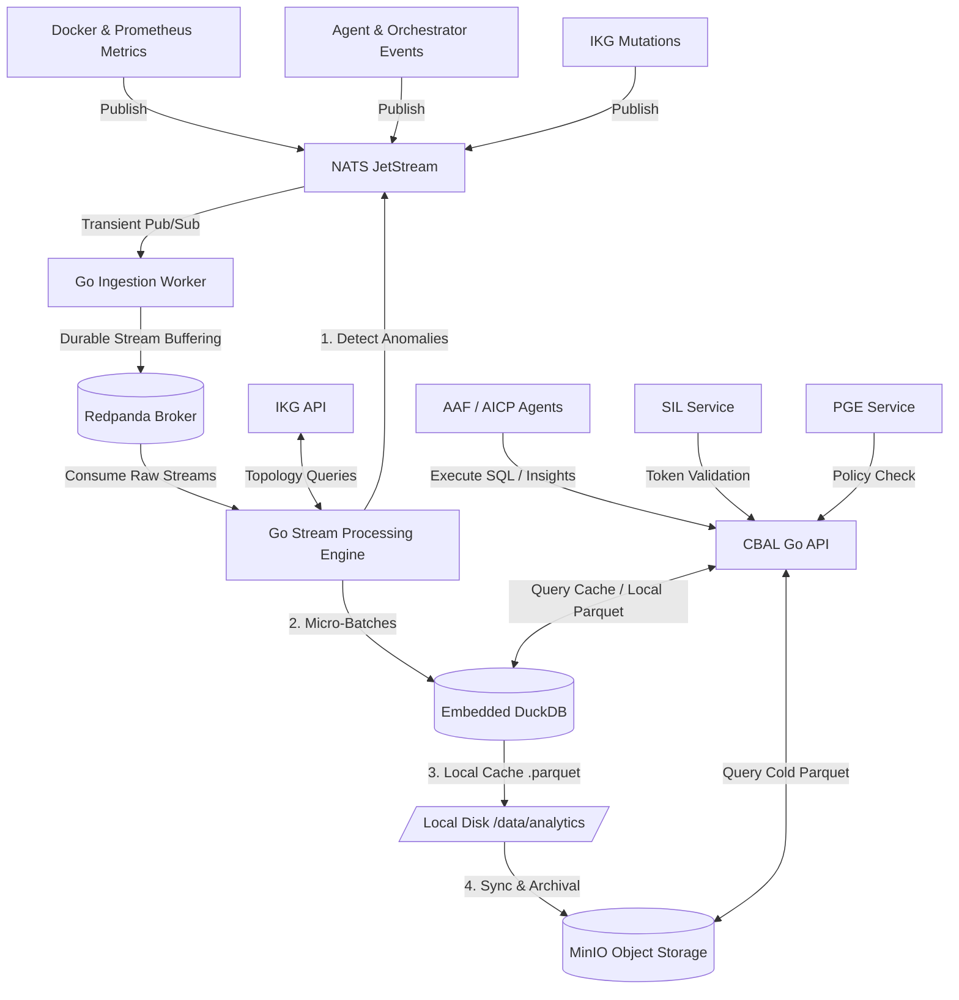

# KalpanaOS — Phase 6: Cognitive Big Data Analytics Layer (CBAL) Architecture

This document describes the design, implementation, data contracts, and operational guidelines for the **Cognitive Big Data Analytics Layer (CBAL)** of KalpanaOS, engineered specifically for resource-constrained sovereign edge infrastructure.

---

## 1. Executive Overview

### The Analytics Mandate in Autonomous Infrastructure
KalpanaOS is a distributed sovereign cognitive infrastructure operating system where agents orchestrate container workloads, manage semantic state, and self-heal in real-time. For agents to perform these operations efficiently, they require a real-time operational intelligence analytics framework. CBAL acts as the **"temporal system intelligence"** of KalpanaOS. It enables edge nodes to analyze telemetry trends, detect cascading anomalies, make data-driven scheduling decisions, and perform self-auditing, without depending on external cloud observability stacks.

### Traditional Big Data Architecture vs. 4GB RAM Constraints
Standard big data systems are designed with the assumption of horizontal scale and unconstrained resources. Modern stacks are built primarily on:
- **Apache Kafka / Flink / Spark:** Heavy JVM-based runtimes that require multiple gigabytes of memory just to instantiate their runtime engines.
- **Elasticsearch:** A Java-based indexing cluster requiring significant heaps and garbage collection cycles that would exhaust edge node capacity.
- **Kubernetes / Prometheus Operator stacks:** Highly declarative and resource-heavy control planes.

Because KalpanaOS operates on a strict **4GB RAM edge node constraint**, standard solutions are unusable. CBAL resolves this by adopting an edge-native, lightweight, C/C++ and Go-native stack:
1. **Redpanda:** A C++-based Kafka-compatible event log. When restricted to single-thread execution and developer-mode limits, it has a footprint of under 100MB RAM.
2. **Lightweight Go Stream Processing:** Custom concurrent Go consumers that enrich telemetry using the in-memory Infrastructure Knowledge Graph (IKG) and aggregate statistics in under 30MB RAM.
3. **Embedded DuckDB:** A serverless OLAP engine compiled directly inside the Go binary. It performs fast vector-based columnar queries without running separate background processes, capping memory dynamically via configuration.
4. **MinIO Object Storage:** A lightweight Go-based S3-compatible local server that manages cold Parquet data lakes in under 80MB RAM.

---

## 2. CBAL Core Architecture

The CBAL system coordinates with NATS JetStream, IKG, SIL, PGE, and MinIO to ingest, process, store, and serve analytics.

### System Diagram



### Data Flow and Storage Hierarchy
1. **Ingest Pipeline:** Metrics and events are published to NATS JetStream. The CBAL ingest loop writes them immediately to Redpanda topics.
2. **Stream Enrichment:** Go workers consume raw events from Redpanda, query the IKG service (`http://ikg:8008`) to fetch topology neighbors, and append graph metadata to the event schemas.
3. **Hot Cache (DuckDB):** Enriched events are batch-inserted into the local embedded DuckDB memory cache (`/data/cbal.db`).
4. **Cold Storage Partitioning:** Hourly, DuckDB flushes historical tables to local Parquet files partitioned by node, date, and priority. These files are then uploaded to MinIO.
5. **API Layer:** Agents query the CBAL API via SQL or pre-computed endpoints. The API queries both the local DuckDB cache (hot) and MinIO Parquet files (cold) transparently.

---

## 3. Redpanda Event Backbone

### 3.1 Topic Architecture
Redpanda acts as the partition-based log storage for analytics data:
- `kalpana.telemetry.metrics`: Raw/aggregated metric points (CPU, RAM, disk, network).
- `kalpana.telemetry.logs`: Operational logs from services and container outputs.
- `kalpana.graph.mutations`: Real-time service topology additions/deletions/updates from IKG.
- `kalpana.orchestration.events`: Deployments, scale actions, agent task registrations.
- `kalpana.remediation.actions`: Auto-recovery events, restarts, and LLM diagnostics.
- `kalpana.policy.evaluations`: Rule audits, authorization successes, and denials from PGE.

### 3.2 Event Contracts (Typed JSON Schemas)

#### Agent Telebeat (Topic: `kalpana.telemetry.metrics`)
```json
{
  "correlation_id": "9b1deb4d-3b7d-4bad-9bdd-2b0d7b3dcb6d",
  "timestamp": "2026-05-24T15:53:18Z",
  "node_id": "edge-node-01",
  "agent_id": "MetricAnalysisAgent",
  "metric_name": "host.memory.usage.pct",
  "value": 78.4,
  "metadata": {
    "cores": "4",
    "region": "eu-sovereign-01"
  }
}
```

#### Orchestration Deploy (Topic: `kalpana.orchestration.events`)
```json
{
  "correlation_id": "1a2b3c4d-5e6f-7a8b-9c0d-1e2f3a4b5c6d",
  "timestamp": "2026-05-24T15:53:18Z",
  "node_id": "edge-node-01",
  "action": "DEPLOY_SERVICE",
  "service_name": "web-server",
  "image": "nginx:alpine",
  "status": "INITIATED",
  "actor": "SchedulerAgent"
}
```

#### Graph Mutation (Topic: `kalpana.graph.mutations`)
```json
{
  "correlation_id": "f47ac10b-58cc-4372-a567-0e02b2c3d479",
  "timestamp": "2026-05-24T15:53:18Z",
  "node_id": "edge-node-01",
  "mutation_type": "ADD_EDGE",
  "from_node": "service_web-server",
  "to_node": "service_database-postgres",
  "relation": "DEPENDS_ON",
  "properties": {
    "port": "5432",
    "network": "kalpana-net"
  }
}
```

### 3.3 Event Prioritization & Retentions
To optimize disk storage, messages are prioritized:
- **CRITICAL:** `remediation.actions`, `policy.evaluations`
  - *Retention:* 30 days. No loss allowed.
  - *Replay Semantics:* Replay from offset 0 available.
- **HIGH:** `graph.mutations`, `orchestration.events`
  - *Retention:* 14 days.
  - *Replay Semantics:* Offset-based; compact history.
- **NORMAL:** `telemetry.metrics`
  - *Retention:* 3 days.
  - *Replay Semantics:* Replay last 72 hours.
- **BACKGROUND:** `telemetry.logs`
  - *Retention:* 24 hours.
  - *Replay Semantics:* Raw ingestion buffer; rolled over rapidly.

### 3.4 Event Replay & Reliability
- **Consumer Offsets:** Workers commit offsets to Redpanda (`__consumer_offsets`) only after flushing micro-batches to the local DuckDB disk transaction log.
- **Idempotency:** Every event contains a `correlation_id`. DuckDB tables enforce unique constraints, or workers execute `INSERT OR IGNORE` using a sliding deduplication cache.
- **Failure Recovery:** If Redpanda is down, the Go workers buffer events in a local SQLite file (`cbal_dlq.db`) and push them upstream once Redpanda reconnects.

---

## 4. Go-Based Stream Intelligence Engine

CBAL implements a stream processor replacing heavy Flink engines.

### 4.1 Stream Worker Architecture
- Built as concurrent Goroutine pools reading from Redpanda partition readers.
- Uses `github.com/twmb/franz-go`, a high-performance, pure-Go Kafka client.
- Implements an internal Go channel buffer of size 1000 per worker to handle spikes.
- Uses a ticker-based flush mechanism (flush every 5 seconds or when buffer reaches 200 records) to aggregate records before committing to DuckDB.

### 4.2 Graph-Aware Stream Processing
When a metric or log event is read, the worker enriches it with topology data:
1. Fetch source `node_id` or `service_name`.
2. Query the local/remote `IKG` service `/graph/{id}` to fetch neighbors.
3. Inject dependency paths (e.g. `service_web-server` depends on `service_db-postgres`, hosted on `edge-node-01`) directly into the telemetry record before archiving it.
4. This adds topological context directly to metrics, allowing SQL queries to join metrics with the active graph model.

### 4.3 Real-Time Anomaly Correlation
Go workers analyze streams over sliding windows to detect:
- **Remediation Storms:** RemediationAgent attempting to fix a container more than 5 times in 5 minutes (indicating a configuration issue).
- **Cascading Failures:** A database failure immediately followed by errors on downstream web servers.
- **Queue Saturation:** Task queue size in AAF growing at a rate $> 2.0$ tasks/sec while scheduler latency increases.

### 4.4 Stream-Derived Insight Generation
When anomalies are detected, workers:
1. Compute a **Topology Risk Score** ($S \in [0.0, 1.0]$) for each node based on failure counts, latency, and drift.
2. Formulate an `Insight` object containing structural summaries.
3. Example Insight: `"Node edge-node-01 is at high risk (Score: 0.82) due to a remediation loop on service_nginx."`

### 4.5 Event Feedback Loop
Generated insights and anomalies are published back to NATS:
- Publish anomaly events to `kalpana.anomalies` to trigger the `RemediationAgent`.
- Publish alerts to `kalpana.alerts` to notify the UI and Grafana.
- Push critical structural changes back to IKG to record node health degradations.

---

## 5. DuckDB Operational Analytics Engine

### 5.1 Storage Architecture
DuckDB is embedded inside the Go binary.
- Writes to local database file `/data/cbal.db` which acts as the hot cache.
- Telemetry is written to memory-buffered tables, then exported hourly to time-partitioned Parquet files on local disk under `/data/analytics/`.
- Cold data queries read directly from Parquet files stored on MinIO using the DuckDB `httpfs` extension.

### 5.2 Telemetry Data Models
```sql
-- Metric History
CREATE TABLE IF NOT EXISTS metric_history (
    timestamp TIMESTAMP,
    correlation_id VARCHAR,
    node_id VARCHAR,
    agent_id VARCHAR,
    metric_name VARCHAR,
    value DOUBLE,
    region VARCHAR,
    PRIMARY KEY (timestamp, correlation_id)
);

-- Orchestration Events
CREATE TABLE IF NOT EXISTS orchestration_history (
    timestamp TIMESTAMP,
    correlation_id VARCHAR,
    node_id VARCHAR,
    action VARCHAR,
    service_name VARCHAR,
    image VARCHAR,
    status VARCHAR,
    actor VARCHAR
);

-- Anomaly History
CREATE TABLE IF NOT EXISTS anomaly_history (
    timestamp TIMESTAMP,
    anomaly_id VARCHAR,
    node_id VARCHAR,
    type VARCHAR,
    description VARCHAR,
    severity VARCHAR,
    resolved BOOLEAN
);
```

### 5.3 Query Engine Design
The Go CBAL service exposes a SQL query interface allowing clients to run standard OLAP SQL.
- **Example Temporal Query:** Get rolling 10-minute average CPU by node.
- **Example Graph-Aware Query:** Calculate average latency of all services linked by `DEPENDS_ON` relations in the last 2 hours.

### 5.4 Time Partitioning Strategy
Parquet exports are organized dynamically:
`/data/analytics/type={metrics|logs|events}/year=YYYY/month=MM/day=DD/node=NODE_ID/data.parquet`
This leverages DuckDB's partition pruning to optimize query execution over specific nodes and timeframes.

### 5.5 Resource Optimization
To fit the 4GB RAM ceiling, the CBAL service issues the following commands to the DuckDB connection pool on startup:
```sql
SET max_memory = '100MB';
SET threads = 1;
SET temp_directory = '/data/duckdb_temp';
```
This forces DuckDB to use only 100MB for memory buffers, execute single-threaded query plans to limit CPU contention, and spill intermediate results to disk when performing large joins or groupings.

---

## 6. MinIO Sovereign Data Lake

### 6.1 Data Lake Structure
MinIO operates in single-node gateway mode:
- Bucket `telemetry-parquet/`: Time-partitioned historical Parquet files.
- Bucket `graph-snapshots/`: Nightly serialized states of the IKG.
- Bucket `agent-memories/`: Epistemic memory exports from Qdrant/SSI.

### 6.2 Sovereign Storage Policies
- **Encryption:** All Parquet blocks are encrypted at rest using SSE-S3. Key material is stored in HashiCorp Vault (`http://vault:8200`).
- **Federation Sharing:** Nodes in the mesh can request syncs of specific partition subsets via NATS.

### 6.3 Archive Lifecycle
- Raw DuckDB data is kept locally for 24 hours.
- Every hour, older records are compressed into Parquet and uploaded to MinIO.
- MinIO bucket life cycle rules automatically delete raw Parquet files after 30 days.
- Long-term cognitive insights are persisted in Qdrant (SSI) forever, maintaining the semantic context without the raw byte weight.

---

## 7. Cognitive Analytics API (CBAL API)

Exposed as a lightweight HTTP microservice on port `8010`.

### 7.1 API Architecture & Endpoints
- `GET /health`: Health status.
- `POST /query`: Execute custom SQL queries using the DuckDB engine. Requires SIL authentication.
- `GET /insights`: Fetch active anomalies and Topology Risk Scores.
- `GET /predict/failure`: Get failure forecasts for edge nodes.
- `POST /compress`: Manually trigger the memory compression lifecycle.

### 7.2 AI Agent Integration
Agents (such as `SchedulerAgent` or `MetricAnalysisAgent`) can leverage CBAL to query telemetry:
- `SchedulerAgent` queries `/query` to find the node with the lowest average CPU/Memory over the past 24 hours.
- `RemediationAgent` queries `/query` to see if a container restart loop was triggered in the last 30 minutes.

### 7.3 Graph-Enhanced Queries
The `/query` endpoint supports graph traversal CTEs. For example, finding the performance of a node and its direct topological neighbors:
```sql
SELECT avg(value) as avg_cpu, node_id 
FROM metric_history 
WHERE metric_name = 'host.cpu.usage' 
  AND node_id IN (SELECT neighbor_id FROM graph_neighbors WHERE source_id = 'edge-node-01')
  AND timestamp > now() - INTERVAL '1 hour'
GROUP BY node_id;
```

### 7.4 Security & Integration
- **Authentication:** Middleware intercepts HTTP requests, extracts the JWT, and validates it against `sil:8001/validate`.
- **Authorization:** Before running queries, CBAL calls `pge:8007/policy/eval` to verify if the requesting agent is permitted to view analytics for that node.
- **Audit Logging:** Every query is logged to `kalpana.policy.evaluations`.

---

## 8. Predictive Infrastructure Intelligence

### 8.1 Predictive Failure Detection
DuckDB evaluates resource usage over linear regressions:
- CPU/Memory drift values are analyzed using a double-exponential smoothing model implemented directly in Go.
- If memory usage is projected to exceed 95% within the next 20 minutes, a warning event is emitted to `kalpana.anomalies`.

### 8.2 Infrastructure Drift Analysis
Drift is calculated by measuring standard deviation anomalies over sliding windows:
$$DriftRatio = \frac{\sigma(Metric_{last\_1\_hour})}{\sigma(Metric_{last\_24\_hours})}$$
If $DriftRatio > 2.5$, the system triggers an alert warning about unstable topology evolution or a slow memory leak.

### 8.3 Federation Intelligence
Telemetry includes node health metrics gossiped over FDCL. DuckDB aggregates these to generate reliability scores for each mesh peer, allowing the orchestrator to dynamically bypass failing nodes.

### 8.4 Agent Cognition Analytics
CBAL captures reasoning execution metrics from AAF:
- LLM latency, token counts, and token processing costs.
- Hallucination indicators (failed configuration applications logged by COL).
- Policy rejection counts (PGE denylist trigger rate).

---

## 9. Memory Compression & Cognitive Summarization

### 9.1 Compression Pipeline
To preserve storage, CBAL runs a scheduled cleanup:
1. Every 24 hours, CBAL fetches raw logs and metrics for the day.
2. Group records by service and time window.
3. Call `aicp:8004/completions` (offloaded to NVIDIA API) with the prompt:
   `"Synthesize these 5000 operational events into a 1-paragraph semantic summary."`
4. The synthesized insight is written to Qdrant (via SSI).
5. The raw log entries in DuckDB/MinIO are pruned.

### 9.2 Cognitive Retention Strategy
Rather than keeping gigabytes of raw CPU metrics, the system retains the high-level historical insight:
- Raw: 1,000,000 floats (8MB).
- Distilled: `"Service web-server experienced a memory spike from 14:00 to 14:30 UTC due to traffic. Resolved via auto-scaling."` (150 bytes).
This achieves a compression ratio $> 99.99\%$.

### 9.3 Temporal Infrastructure Memory
DuckDB and SSI store timestamped snapshots, enabling the `RemediationAgent` to reconstruct and replay the exact state of the infrastructure at any past epoch $T$.

---

## 10. Resource-Constrained Deployment Strategy

### 10.1 RAM Budgeting (Strict 4GB Limit)

Here is how the system remains operational within the 4GB ceiling:

| Service / Component | Baseline RAM | Peak RAM Ceiling | Resource Constraints |
| :--- | :--- | :--- | :--- |
| **Qdrant** | 150 MB | 400 MB | `mem_limit: 400m` |
| **Prometheus** | 100 MB | 200 MB | `mem_limit: 200m`, low retention |
| **Loki** | 80 MB | 150 MB | `mem_limit: 150m` |
| **Tempo** | 50 MB | 150 MB | `mem_limit: 150m` |
| **Redpanda** | 80 MB | 150 MB | `mem_limit: 150m`, Developer mode |
| **MinIO** | 40 MB | 80 MB | `mem_limit: 80m`, Single-drive |
| **CBAL Service (Go + DuckDB)** | 60 MB | 150 MB | `mem_limit: 150m`, DuckDB `max_memory='100MB'` |
| **Existing Services (SIL/COL/SSI/AICP/AAF/IKG/PGE/FDCL)** | 350 MB | 600 MB | Combined lightweight limits |
| **Grafana** | 60 MB | 150 MB | `mem_limit: 150m` |
| **Docker + OS Overhead** | 1.0 GB | 1.5 GB | Bounded host footprint |
| **TOTAL** | **~2.07 GB** | **~3.58 GB** | **Safely under 4.0 GB RAM** |

### 10.2 Lightweight Deployment Profiles
- **Ultra-Light:** Disables Loki, Tempo, and Redpanda. Go workers read directly from NATS JetStream and flush to SQLite.
- **Single-Node Edge:** Full stack enabled. Redpanda and MinIO constrained as shown above.
- **Federated Edge:** Enables gossip and cross-node analytics sharing.

### 10.3 Failure Recovery & Backpressure
- **Backpressure:** If DuckDB writes block, the Go stream worker pauses reading from Redpanda.
- **OOM Recovery:** Docker policies (`restart: unless-stopped`) automatically restart services. SQLite transaction logs guarantee no state is corrupted during dirty shutdowns.

---

## 11. Future Evolution Path
- **ClickHouse Migration:** If edge nodes upgrade memory, ClickHouse can replace DuckDB as a standalone server.
- **Distributed Redpanda:** Moving from single-node broker to a multi-node Raft cluster.
- **Sovereign Federated Analytics:** Federated SQL queries where node A queries node B's local DuckDB directly via NATS RPC.

---

## 12. Research Opportunities
- **Causal Infrastructure Reasoning:** Using graph topologies and metrics to isolate root causes.
- **Self-Optimizing Edge Operating Systems:** Operating systems that use LLMs to dynamically balance their own analytics storage.
