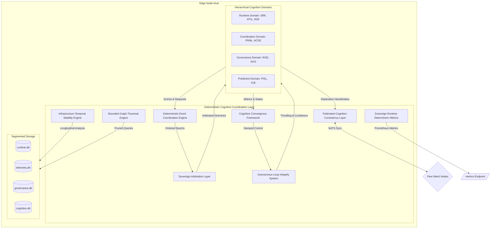

# KalpanaOS — Phase 7A.2: Deterministic Cognitive Coordination Layer (DCCL)

This document describes the systems architecture, mathematical models, event ordering protocols, and loop integrity systems for the **Deterministic Cognitive Coordination Layer (DCCL)** of KalpanaOS.

---

## 1. DCCL Architecture Overview

The Deterministic Cognitive Coordination Layer (DCCL) sits as a sovereign coordination substrate above the Hierarchical Cognition Domains (HCD). It enforces deterministic convergence bounds and prevents constitutional deadlocks, oscillation cascades, and cognition starvation across the federated edge nodes.

### System Architecture Topology



---

## 2. Sovereign Arbitration Layer (SAL)

The Sovereign Arbitration Layer (SAL) resolves overlapping and conflicting intents originating from different Hierarchical Cognition Domains (HCD), preventing constitutional deadlocks (e.g., when the scheduler attempts a container placement while the governance engine blocks it and the recovery system requests a restart).

### Priority Hierarchy
SAL enforces a strict deterministic precedence tree:

$$\text{Precedence Order: } \text{Governance (RGE)} \succ \text{Recovery (RSF)} \succ \text{Coordination (ACSE)} \succ \text{Predictive (PISL)}$$

1. **Governance (RGE/AGS)**: Hard constraints (e.g. security policies, capability restrictions, absolute quota blocks). Can override any action.
2. **Recovery (RSF)**: Remediation directives (e.g. quarantining a failing container). Overrides placement auctions.
3. **Coordination (ACSE)**: Structural alignment (e.g. scheduling, migration, node-balancing).
4. **Predictive (PISL)**: Optimization anomalies (e.g. drift adjustments, preemptive compactions).

### Conflict Arbitration State Machine

```
   [Incoming Intents]
           │
           ▼
┌──────────────────────┐
│  Intent Evaluator   │ ◄─── Read governance.db (policy rules)
└──────────┬───────────┘
           │
           ├─────────────────────────┐
           ▼ (Domain Override)       ▼ (No Conflict)
┌──────────────────────┐   ┌──────────────────────┐
│    Apply Overrides   │   │  Dispatch Intent     │
│ (RGE > RSF > ACSE)   │   └──────────────────────┘
└──────────┬───────────┘
           │
           ▼
┌──────────────────────┐
│ Arbitrated Decision  │
│      Dispatch        │
└──────────────────────┘
```

---

## 3. Deterministic Event Coordination Engine (DECE)

The Deterministic Event Coordination Engine (DECE) sequences asynchronous cognitive and operational events across the federated mesh, ensuring that all nodes perceive state transitions in a topologically equivalent order.

### Bounded Lamport Coordination
To prevent event ordering divergence under network latency or temporary partitions, DECE assigns a monotonic coordinate to every event:

$$EventID = (Epoch, \tau_L, NodeID)$$

* **Epoch**: Monotonically increasing mesh synchronization epoch (reset or bumped on partition merges).
* **$\tau_L$**: Lamport Logical Timestamp:

$$\tau_L = \max(\tau_{local}, \tau_{received}) + 1$$

* **NodeID**: String identifier of the originating node, acting as a deterministic tie-breaker (lexicographical sorting).

### Distributed Causality Window
Events arriving within a time window $\Delta \tau_{causal} = 500\text{ms}$ are held in a deterministic delay queue and sorted by their Lamport coordinate before processing, ensuring consistent ordering of concurrent operations.

---

## 4. Cognitive Convergence Framework (CCF)

The Cognitive Convergence Framework (CCF) guarantees that autonomous feedback loops eventually stabilize, preventing infinite optimization oscillations (e.g., scheduling migrations back and forth between two nodes).

### Damping Algorithm
Define the stabilization state of a workload $W$ over a sliding window $T_{window}$:

$$F_{oscillation}(W) = \sum_{t \in T_{window}} \mathbb{I}(\text{StateChange}_t)$$

Where $\mathbb{I}$ is the indicator function. If $F_{oscillation}(W) \ge 3$, the workload enters the **Damped state**. The recovery and migration cooldowns are scaled exponentially:

$$Cooldown_{damped} = Cooldown_{base} \cdot e^{\lambda \cdot F_{oscillation}(W)}$$

Reasoning cycles are suspended for the duration of the cooldown to allow physical systems to settle.

---

## 5. Federated Cognition Consistency Layer (FCCL)

The Federated Cognition Consistency Layer (FCCL) synchronizes semantic infrastructure memory and intent graphs across edge nodes without the high latency and memory overhead of heavyweight consensus models (Raft/Paxos).

### Replicated Adjacency Graph State (RAGS)
FCCL utilizes Observed-Remove-Set (OR-Set) CRDT semantics to reconcile Intent Graph updates over NATS.

```sql
CREATE TABLE IF NOT EXISTS fccl_reconciliation (
    element_id TEXT PRIMARY KEY,
    element_type TEXT NOT NULL, -- node | edge
    payload TEXT NOT NULL,
    vector_clock TEXT NOT NULL,
    tombstone INTEGER DEFAULT 0,
    last_modified TIMESTAMP DEFAULT CURRENT_TIMESTAMP
);
```

Reconciliation handshakes occur as periodic NATS exchanges:
1. Nodes broadcast a Merkle Hash of their local `fccl_reconciliation` state.
2. If hashes mismatch, nodes exchange delta payloads and merge them using Vector Clock comparisons.

---

## 6. Infrastructure Temporal Stability Engine (ITSE)

The Infrastructure Temporal Stability Engine (ITSE) detects long-term behavioral drift (e.g. memory leaks, slow response-time decay, recurring scheduling oscillations) and forces the system toward a stable operational equilibrium.

### Drift Evaluation Formula

$$BehavioralDrift = w_{cpu} \cdot \sigma^2(CPU) + w_{mem} \cdot \frac{d(MEM)}{dt} + w_{temp} \cdot (T_{avg} - T_{ambient})$$

Where $\sigma^2$ is the variance, and $\frac{d(MEM)}{dt}$ is the regression slope of memory growth. If the drift exceeds the equilibrium boundary ($BehavioralDrift > 0.85$), ITSE triggers a **Compaction & Cleanup Action**, resetting memory cache segments and locking topology mutations for 15 minutes.

---

## 7. Bounded Graph Traversal Engine (BGTE)

The Bounded Graph Traversal Engine (BGTE) prevents memory exhaustion and budget starvation during Intent Graph query traversals.

### Traversal Budget Bounds
* **Max Search Depth**: $Depth_{max} = 3$.
* **Causal Prioritization Score ($CS$)**:

$$CS(node) = \gamma^{depth} \cdot Priority(node.Type)$$

Where $\gamma = 0.5$ is the decay factor. Graph traversal branches are pruned immediately when $CS(node) < 0.125$.

---

## 8. Autonomous Loop Integrity System (ALIS)

The Autonomous Loop Integrity System (ALIS) monitors, registers, and governs all background control loops to prevent cross-loop feedback amplification.

### Registered Loops
* **Reconciliation Loop**: Synchronizes desired state with Docker.
* **Telemetry Loop**: Gathers and writes metrics to `telemetry.db`.
* **Gossip Loop**: Publishes heartbeats over NATS.
* **Drift Loop**: Regression analyzer in `pisl.go`.
* **Compaction Loop**: SQLite WAL checkout and graph prune.
* **FCCL Sync Loop**: Mesh graph reconciliation.

ALIS calculates **Loop Entropy ($H_L$)**:

$$H_L = \sum_{L \in Loops} \frac{\text{ExecutionDuration}_L}{\text{Interval}_L}$$

If $H_L > 0.75$, ALIS introduces execution offsets and forces non-essential loops (Drift, Compaction, Gossip) into low-priority cooldown cycles.

---

## 9. Sovereign Runtime Determinism Metrics (SRDM)

To monitor infrastructure stability, SRDM calculates and exports key metrics:

| Metric | Name | Formula | Alert Threshold |
| :--- | :--- | :--- | :--- |
| **Cognitive Stability Index** | `CSI` | $CSI = 1.0 - \min(1.0, \text{BehavioralDrift})$ | $< 0.30$ (Severe Drift) |
| **Autonomous Convergence Score** | `ACS` | $ACS = e^{-\lambda \cdot F_{oscillation}}$ | $< 0.40$ (Oscillation loop) |
| **Governance Integrity Score** | `GIS` | $GIS = \frac{\text{AllowedAudits}}{\text{AllowedAudits} + \text{DeniedAudits} + 1}$ | $< 0.50$ (Frequent Policy Denials) |
| **Recovery Stability Ratio** | `RSR` | $RSR = \frac{\text{SuccessfulRemediations}}{\text{TotalCrashes} + 1}$ | $< 0.25$ (Failure to Recover) |
| **Federated Consistency Index** | `FCI` | $FCI = 1.0 - \frac{\text{OutofSyncElements}}{\text{TotalElements} + 1}$ | $< 0.80$ (Divergent Mesh Graphs) |
| **Event Determinism Score** | `EDS` | $EDS = \frac{\text{InOrderEvents}}{\text{TotalEvents} + 1}$ | $< 0.90$ (Out-of-Order Delivery) |
| **Topology Stability Metric** | `TSM` | $TSM = e^{-\text{MigrationsPerHour}}$ | $< 0.36$ (Excessive Rebalancing) |
| **Cognitive Saturation Ratio** | `CSR` | $CSR = \frac{\text{UsedCredits}}{\text{TotalBudget}}$ | $> 0.90$ (Cognitive Starvation) |

---

## 10. Implementation Plan & Evolution Roadmap

### Phase 7A.2 Engineering Milestones
1. **DCCL Core & Vector Clocks**: Implement `VectorClock` structures, Lamport sequencing, and tie-breakers.
2. **Sovereign Arbitration Module**: Write the SAL override and precedence tree routing engine.
3. **Cognitive Convergence Engine**: Develop CCF damping metrics and cooldown throttle hooks.
4. **Adjacency CRDT Sync**: Implement the FCCL state reconciliation protocol over NATS subjects.
5. **ALIS & SRDM Pipelines**: Register all background loops, compile loop execution statistics, and expose metrics via Chi and PromHTTP.

### Long-Term Evolution Roadmap
```
┌─────────────────────────────────┐
│     Phase 7A.2: DCCL Core       │ ──► Vector Clocks, SAL precedence, CCF damping algorithms
└────────────────┬────────────────┘
                 │
                 ▼
┌─────────────────────────────────┐
│  Phase 7B: Decentralized Mesh   │ ──► LibP2P encrypted overlay, federated semantic reasoning
└────────────────┬────────────────┘
                 │
                 ▼
┌─────────────────────────────────┐
│    Phase 7C: MicroVM Hypervisor │ ──► Replace Docker wrapper with Firecracker MicroVMs
└─────────────────────────────────┘
```
