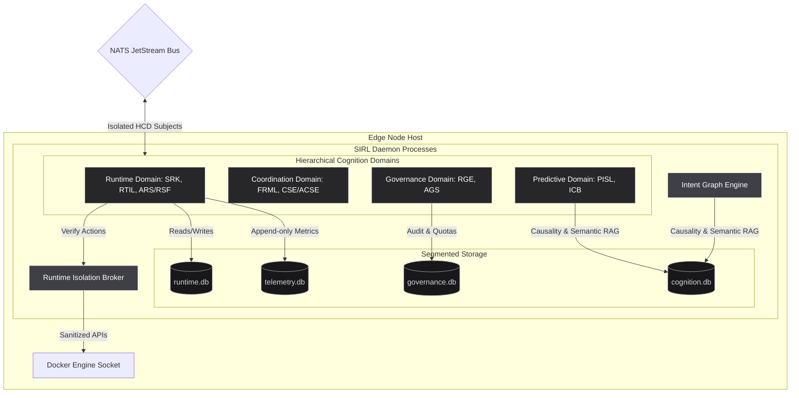

# KalpanaOS — Phase 7A.1: Hardened Sovereign Infrastructure Runtime Layer (SIRL)

This document describes the systems architecture, security isolation, storage segmentation, causal intent mapping, and resource-bounded execution protocols for the **Sovereign Infrastructure Runtime Layer (SIRL)** of KalpanaOS.

---

## 1. Hardened SIRL Architecture

The stabilized SIRL architecture establishes a strict **Runtime Isolation Broker (RIB)** that sandboxes the Docker socket, segments runtime cognition into isolated domains, and partitions operational storage to eliminate lock contention under telemetry pressure.

### System Architecture Topology



---

## 2. Runtime Isolation Design

To protect edge nodes from container breakout, the **Runtime Isolation Broker (RIB)** sits as an inline security boundary between the execution manager (SRK) and `/var/run/docker.sock`.

### Interception Request Flow

```
   [SRK Workload Request]
             │
             ▼
┌──────────────────────────┐
│   RIB Policy Validator   │ ──► Check privileged flags, network mode, capabilities
└──────────────────────────┘
             │
             ├──────────────────────────┐
             ▼ (Violates)               ▼ (Passes)
    [Reject Deployment]        [Sanitized API Dispatch]
     Audit -> Log               Forward to docker.sock
```

### Sanitization Restrictions
The RIB enforces the following execution policies:
* **Privileged Containers:** Forces `Privileged = false` in `HostConfig`. Blocks startup if requested.
* **Host Networking:** Rejects `NetworkMode = "host"`. Forces execution inside isolated `kalpana-net`.
* **Capability Filter:** Drops dangerous Linux capabilities. Explicitly sets `CapDrop = []string{"ALL"}` and permits only `CapAdd = []string{"NET_BIND_SERVICE"}`.
* **SYS_ADMIN Escalation:** Rejects any custom seccomp profile overrides or privileged escalations (`NoNewPrivileges = true`).
* **Mount Protections:** Parses mounts. Rejects paths intersecting with the host filesystem root `/` or system paths `/etc`, `/sys`, `/var`, `/boot`. Permits only explicit sub-volumes within `sirl-data`.

### Future MicroVM (Firecracker) Migration Path
The RIB API contracts are designed to facilitate plug-in replacement of the backend runtime. Since commands are structured as JSON execution intents, the underlying driver can migrate from Docker containers to light-virtualization microVMs (Firecracker) by compiling the intent into an OCI rootfs with an init process, mounting it as a read-only block device, and spawning it via a local Firecracker API socket (`/run/firecracker.socket`).

---

## 3. Cognition Domain Segmentation

Runtime logic is split into four distinct Hierarchical Cognition Domains (HCD) that communicate exclusively over predefined NATS JetStream topics. 

| Cognition Domain | Contained Services | Primary Data Scope | Permitted Output Channels |
| :--- | :--- | :--- | :--- |
| **Runtime** | SRK, RTIL, RSF | Container lifecycle, local logs, timeseries metrics | `kalpana.sirl.domain.runtime.events.>` |
| **Coordination** | FRML, ACSE | Node capabilities, mesh topology, placement auctions | `kalpana.sirl.domain.coordination.>` |
| **Governance** | RGE, AGS | Policy compliance, agent action quotas, audit logs | `kalpana.sirl.domain.governance.>` |
| **Predictive** | PISL, ICB | Metric regression models, pre-flight dry runs, node cognition budgets | `kalpana.sirl.domain.predictive.>` |

### Rules of Engagement
1. **No Shared Memory:** Domains must never access each other's database sessions directly or read raw in-memory caches.
2. **Asynchronous Handshakes:** Requests between Coordination (ACSE) and Runtime (SRK) are routed via NATS Request-Reply RPC, avoiding synchronous process locks.
3. **Causality Trace-ability:** All cross-domain events must pass the active `correlation_id` to preserve causality chains.

---

## 4. Adaptive Scheduler Redesign

The **Adaptive Cognitive Scheduler Engine (ACSE)** introduces probabilistic scheduling that adapts dynamically based on node stability history.

### The Node Stability Index (NSI)

$$NSI(N) = \frac{\text{Successful Runtime Hours}_N}{\text{Crash Events}_N + \text{Thermal Events}_N + \text{Policy Violations}_N + 1.0}$$

### Probabilistic Suitability Score ($S$)

For a workload $W$ and target node $N$, the placement suitability $S(N, W)$ is formulated as:

$$S(N, W) = NSI(N) \cdot \left[ w_r \cdot R(N, W) + w_t \cdot T(N) + w_s \cdot S_{\text{trust}}(N) + w_e \cdot E(N) \right]$$

* **Quarantine Boundary:** If $NSI(N) < 0.25$, the node loses placement priority entirely.
* **Adaptive Weighting Feedback Loop:** If a node experiences transient CPU spikes, the ACSE increases the weight of the resource factor ($w_r$) and decreases proximity priority ($w_e$) to prevent node overload.

---

## 5. Distributed Storage Architecture

To prevent disk locking contention under heavy telemetry loads, storage is segmented into four distinct SQLite databases.

```
                  ┌──────────────────────┐
                  │    sirld Write Bus   │
                  └──────────┬───────────┘
                             │
       ┌─────────────────────┼─────────────────────┐
       ▼                     ▼                     ▼
  governance.db         telemetry.db           runtime.db
 (WAL, Sync=FULL)      (WAL, Sync=OFF)      (WAL, Sync=NORMAL)
       │                     │                     │
       ├─ policy rules       ├─ metrics cache      ├─ workload statuses
       └─ audit logs         └─ ring buffers       └─ recovery states
```

### DB Isolation Configurations
1. **`telemetry.db`**: Configured with `PRAGMA synchronous = OFF` and `PRAGMA journal_mode = WAL`. Writes are buffered in memory in a thread-safe ring-buffer of size 1000 and flushed in async chunks of 100 entries.
2. **`cognition.db`**: Stores adjacency lists and semantic edge embeddings. Kept small using recursive compaction.
3. **`governance.db`**: Enforces strict audit trails with `PRAGMA synchronous = FULL` to guarantee persistence.
4. **`runtime.db`**: Stores desired state targets. Synchronous is set to `NORMAL` to balance speed and safety.

---

## 6. Intent Graph Engine (IGE)

All infrastructure modifications are mapped as Directed Acyclic Graphs (DAG) tracing cause-and-effect lifecycles.

### Causal Relationship Schema

```
[Intent: Deploy Workload]
           │
           ▼ (ACSE scheduling)
[Decision: Award to Node-01]
           │
           ▼ (RIB deployment)
[Action: ContainerCreate & Run]
           │
           ▼ (RTIL observability)
[Effect: CPU Spike / Latency Increase]
           │
           ▼ (Failure detected)
[Recovery: Restart / Rollback]
           │
           ▼ (Distillation & summary)
[Memory: Node-01 capacity warning cached]
```

### Graph Adjacency List Schema
Stored in `cognition.db`:
```sql
CREATE TABLE IF NOT EXISTS graph_nodes (
    id TEXT PRIMARY KEY,
    type TEXT NOT NULL, -- intent, decision, action, effect, recovery, memory
    detail TEXT NOT NULL,
    timestamp TIMESTAMP DEFAULT CURRENT_TIMESTAMP
);

CREATE TABLE IF NOT EXISTS graph_edges (
    from_node TEXT NOT NULL,
    to_node TEXT NOT NULL,
    relation_type TEXT NOT NULL, -- CAUSE_OF, TRIGGERED_BY, ENFORCED_BY, MUTATED_TO
    PRIMARY KEY (from_node, to_node, relation_type),
    FOREIGN KEY (from_node) REFERENCES graph_nodes(id),
    FOREIGN KEY (to_node) REFERENCES graph_nodes(id)
);
```

---

## 7. Event Saturation Control

The **Event Saturation Governance Layer (ESGL)** mitigates telemetry storms that can saturate network connections and exhaust cognitive reasoning buffers.

### Event Classification Matrix
* **Critical (Priority 1):** Container crashes, policy violations, CPU threshold violations. Dispatched immediately with zero buffering.
* **Operational (Priority 2):** Periodic CPU/RAM metrics, gossip heartbeats. Buffered in a local memory sliding-window and flushed as 5-minute averages.
* **Cognitive (Priority 3):** Anomaly predictions, drift metrics. Summarized by local Go workers into semantic summaries before transmission, compressing telemetry payloads by up to $90\%$.

---

## 8. Agent Autonomy Sandboxing

The **Autonomous Governance Sandbox (AGS)** establishes boundaries to prevent multi-agent loops from destabilizing infrastructure.

### Runtime Budgets & Quotas
* **Recursion Limit:** Intercepts agent tasks. If an agent request triggers another child agent task recursively, the AGS limits the recursion tree depth to a maximum of $D_{\text{max}} = 3$.
* **Action Quotas:** Limits modifying actions (starts, stops, restarts) to $N_{\text{max}} = 5$ actions per agent per hour. Once exceeded, further actions are blocked, requiring operator clearance.
* **Concurrency Ceiling:** Restricts concurrent task executions per agent to $C_{\text{max}} = 2$ threads.

---

## 9. Recovery Stabilization System

The **Recovery Stabilization Framework (RSF)** defines recovery state machine states for workloads to prevent recovery loop storms.

```
       ┌──────────┐
  ┌──> │  NORMAL  │ ──┐ (Exit status != 0)
  │    └──────────┘   │
  │                   ▼
  │    ┌──────────┐ <─┘
  │    │RECOVERING│ ──┐ (Failures >= 3)
  │    └──────────┘   │
  │                   ▼
  │    ┌──────────┐ <─┘
  │    │ DEGRADED │ ──┐ (Failures >= 5)
  │    └──────────┘   │
  │                   ▼
  │    ┌──────────┐ <─┘
  │    │QUARANTIN │ ──┐ (Remediation fails)
  │    └──────────┘   │
  │                   ▼
  │    ┌──────────┐ <─┘
  └────│  MANUAL  │
       └──────────┘
```

* **Degraded State:** Restarts are suspended. The container is throttled to 10% CPU usage, and NATS alerts are published to notify the scheduler of service health degradation.
* **Quarantined State:** The container is stopped, network mounts are isolated, and the scheduler is blocked from attempting reschedule actions.

---

## 10. Infrastructure Cognition Budgeting (ICB)

To protect the edge host from CPU/RAM starvation due to background reasoning tasks, we introduce a **Cognition Budget Matrix**.

### Cognition Resource Costs

| Cognition Action | Token Weight (Cost) | Max Concurrency | Throttling Action |
| :--- | :--- | :--- | :--- |
| **Embedding Generation** | 5 credits | 3 | Queue and delay |
| **Prediction Simulation** | 8 credits | 2 | Reduce simulation depth |
| **Graph Traversal** | 12 credits | 1 | Serialize execution |
| **Recovery Analysis** | 7 credits | 2 | Run un-cached local check |

* **Dynamic Allocation:** The local node maintains a budget of $100$ cognitive credits per minute. If the remaining host RAM falls below 20%, the credit budget is dynamically throttled to $30$ credits, suspending low-priority simulations.

---

## 11. NATS Subject Topology

The communication paths between domains are structured into isolated subjects:

* `kalpana.sirl.domain.runtime.events.workload.*` (Started, Stopped, Crashed notifications)
* `kalpana.sirl.domain.runtime.commands.deploy.*` (SRK deployment executions)
* `kalpana.sirl.domain.coordination.gossip.heartbeat` (Node state capability updates)
* `kalpana.sirl.domain.coordination.proposal.request` (Scheduler placement auctions)
* `kalpana.sirl.domain.governance.audit.logs` (Immutable policy audit tracking)
* `kalpana.sirl.domain.predictive.forecast.warnings` (Drift and leak warnings)

---

## 12. Go Service Structures

We update the `sirld` Go module to implement the hardened structures:

```go
// RIB wraps docker client
type IsolationBroker struct {
    cli *dockerclient.Client
    cfg Config
}

// segmented databases
type SegmentedStorage struct {
    RuntimeDB    *sql.DB
    TelemetryDB  *sql.DB
    GovernanceDB *sql.DB
    CognitionDB  *sql.DB
}

// Intent Graph Engine
type IntentGraph struct {
    db *sql.DB
}

// Cognition Budgeting
type BudgetEngine struct {
    mu            sync.Mutex
    CreditsLeft   int
    Throttling    bool
    LastReplenish time.Time
}
```

---

## 13. Database Schemas

Schemas are separated across isolated DB files:

### `telemetry.db`
```sql
CREATE TABLE IF NOT EXISTS metrics (
    timestamp TIMESTAMP DEFAULT CURRENT_TIMESTAMP,
    cpu REAL,
    memory INTEGER,
    temperature REAL
);
```

### `governance.db`
```sql
CREATE TABLE IF NOT EXISTS audit_logs (
    id TEXT PRIMARY KEY,
    operator TEXT NOT NULL,
    action TEXT NOT NULL,
    resource TEXT NOT NULL,
    outcome TEXT NOT NULL,
    timestamp TIMESTAMP DEFAULT CURRENT_TIMESTAMP
);

CREATE TABLE IF NOT EXISTS agent_quotas (
    agent_id TEXT PRIMARY KEY,
    action_count INTEGER DEFAULT 0,
    recursion_depth INTEGER DEFAULT 0,
    last_reset TIMESTAMP DEFAULT CURRENT_TIMESTAMP
);
```

---

## 14. Runtime APIs

* `POST /api/sirl/governance/quota/validate` - Evaluates agent actions against the active quota.
* `GET /api/sirl/intent/lineage/{workload_id}` - Returns the full causality chain for a given workload.
* `POST /api/sirl/predict/simulation` - Runs a pre-flight deployment simulation.

---

## 15. State Transition Diagrams

Workload container states under the hardened RSF:

```
[INIT] ──► [POLICY_EVAL] ──► [SIMULATING] ──► [RUNNING]
                                                │
       ┌───────────────── (Exit Code != 0) ─────┘
       ▼
[RECOVERING] ──► (Failures >= 3) ──► [DEGRADED] ──► (Failures >= 5) ──► [QUARANTINED]
```

---

## 16. Infrastructure Cognition Loops

The background control loops run in strict separation:
* **Reconciliation loop:** Operates in `runtime.db` to sync Docker status with desired states.
* **Telemetry loop:** Appends raw metrics to `telemetry.db` and triggers async compaction.
* **Prediction loop:** Analyzes memory drift trends using data from `telemetry.db` and writes results to `cognition.db`.

---

## 17. Resource Optimization Models

Under the strict **4GB RAM ceiling**, memory is constrained as follows:
* **SQLite Memory Limits:** Each DB connection runs with `PRAGMA max_memory='20MB'`. Combined DB memory is capped at $80\text{MB}$.
* **Asynchronous Buffer Limits:** Ring buffers use pre-allocated static arrays to avoid Go heap allocation spikes and garbage collection latency.

---

## 18. Security Enforcement Flows

1. **Deployment Trigger:** Scheduler dispatches command payload to SRK.
2. **RIB Interception:** The SRK passes the container configuration to the RIB wrapper.
3. **Validation Check:** RIB inspects parameters. If any security policies are violated, execution halts and the incident is logged in `governance.db`.
4. **Execution:** Validated requests are compiled into OCI configuration and sent to the Docker engine.

---

## 19. Edge Survivability Guarantees

* **Mesh Partitioning:** If NATS connection is lost, HCD Coordination domain enters **Part-Offline state**. Local workloads are preserved under the Runtime domain, and scheduling uses only local nodes.
* **Database Resiliency:** SQLite databases are configured in WAL mode. If the host experiences dirty shutdowns or power losses, the WAL journal recovers the database state without corruption.

---

## 20. Long-Term Evolution Roadmap

1. **Firecracker Driver Integration:** Replace the Docker SDK driver in the RIB with a Firecracker driver, running unprivileged workloads in isolated microVMs.
2. **LibP2P Encrypted Overlay:** Evolve gossip protocols into an encrypted peer-to-peer network mesh using `go-libp2p` to securely federate edge nodes.
3. **Causal Reasoning Models:** Utilize local semantic graph embeddings to enable agents to determine node failure causes dynamically.
